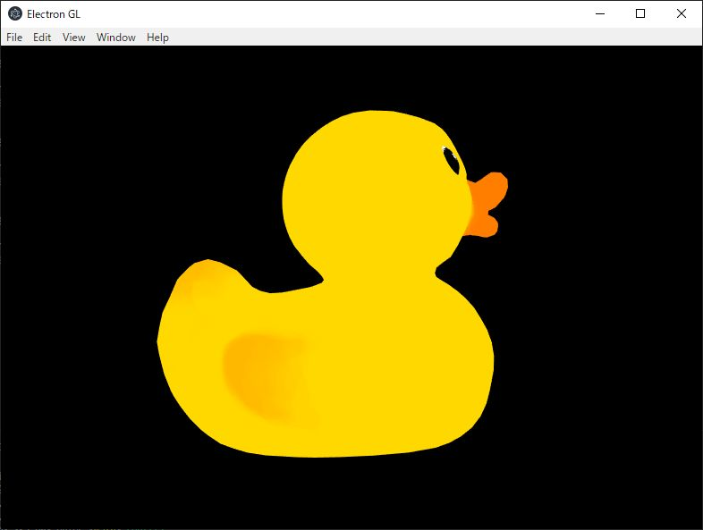

# electron_gl

WebGL practice.

* typescript
* WebGL2

## ToDo

* [x] mouse orbit camera
* [x] file open dialog
* [x] gltf buffer manager
* [x] open to electron menu
* gizmo
  * [ ] bounding box
  * [ ] axis
  * [ ] grid
* [ ] camera position when load
* [x] submesh
* [x] material
* [x] shader manager
  * [x] unlit
  * [ ] PBR
* [ ] gltf id management in main thread
* [x] UV attribute
* [ ] first data, then load. separate scene graph with renderer resource
